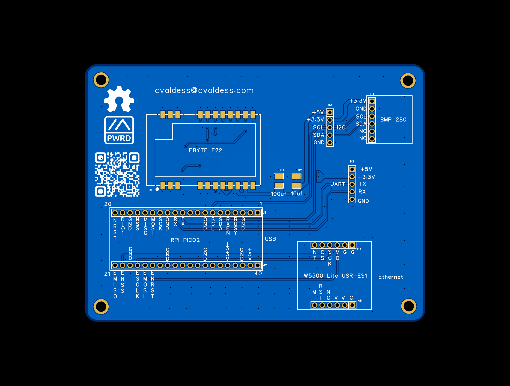
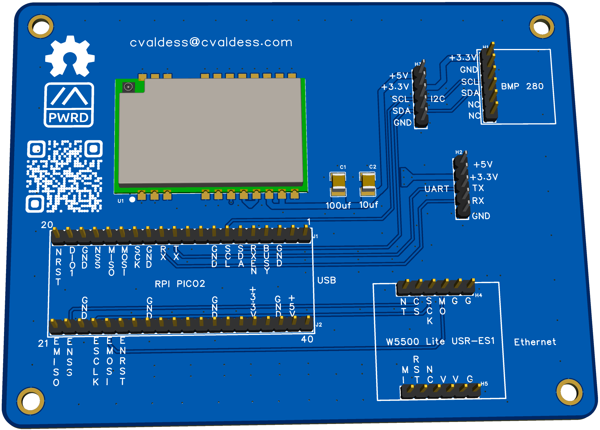
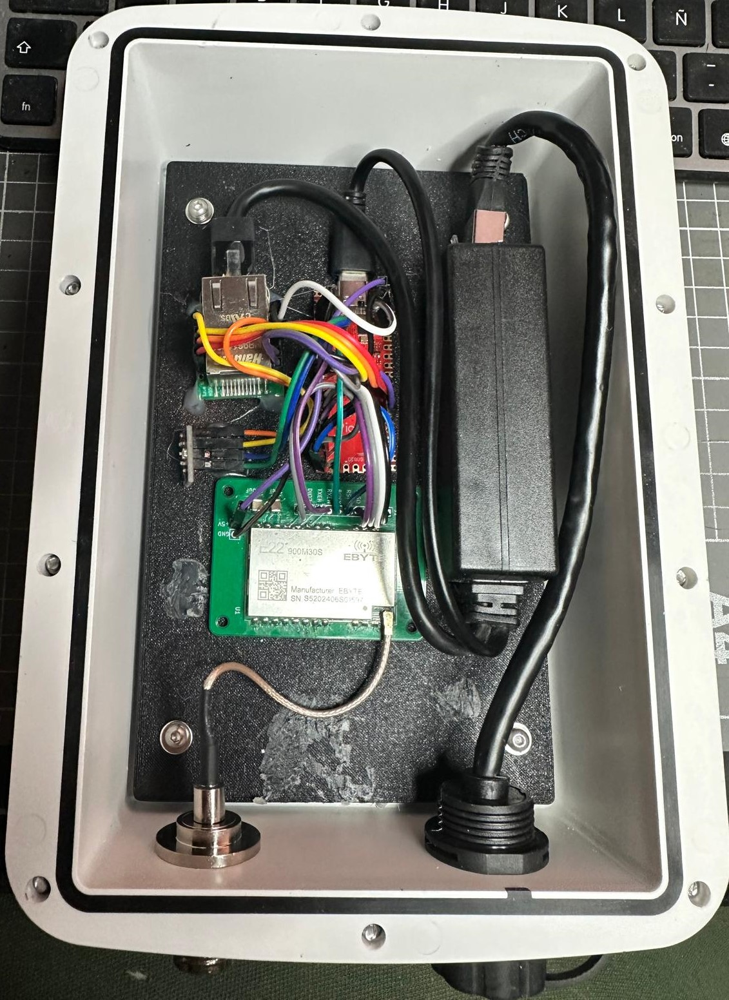

# Pico2_W5500_E22

A custom PCB carrier board that integrates a **Raspberry Pi Pico 2**, **W5500 Ethernet module**, and **Ebyte E22 LoRa module** into a single compact design for Meshtastic applications.

## License

This project is licensed under the [GNU General Public License v2.0](LICENSE).

## Author

**cvaldess** — [cvaldess@cvaldess.com](mailto:cvaldess@cvaldess.com)

## Web Site

**https://meshtastic.cvaldess.com** - [meshtastic.cvaldess.com](https://meshtastic.cvaldess.com)

## PCB

## Features

- **Raspberry Pi Pico 2** — RP2350-based microcontroller with dual-core Arm Cortex-M33 / RISC-V
- **W5500 Lite (USR-ES1)** — Hardwired TCP/IP Ethernet controller via SPI for reliable wired network connectivity
- **Ebyte E22 (900M30S)** — LoRa transceiver module (900 MHz, 30 dBm) for long-range wireless communication
- **BMP280 sensor header** — Dedicated footprint (H1) for a BMP280 temperature and pressure sensor via I2C
- **I2C expansion header** (H3) — +5V, +3.3V, SCL, SDA, GND for additional I2C peripherals
- **UART expansion header** (H2) — +5V, +3.3V, TX, RX, GND for serial communication
- **Decoupling capacitors** — 100 µF and 10 µF for power supply filtering
- **PoE PD** - Power Supply.

## Board Images

| 2D Layout | 3D Render | Experimental |
|:---------:|:---------:|:---------:|
|  |  |  |

## Schematic

The full schematic is available as an SVG file:

- [SCH_Schematic-Pico2_W5500_E22.svg](SCH_Schematic-Pico2_W5500_E22.svg)

## Pin Mapping

### W5500 Ethernet (SPI)

| W5500 Pin | Pico 2 Pin |
|-----------|------------|
| MISO      | SPI MISO   |
| MOSI      | SPI MOSI   |
| SCK       | SPI SCK    |
| CS        | SPI CS     |
| RST       | GPIO       |
| INT       | GPIO       |

### Ebyte E22 LoRa (UART + Control)

| E22 Pin | Pico 2 Pin |
|---------|------------|
| TX      | UART RX    |
| RX      | UART TX    |
| M0      | GPIO       |
| M1      | GPIO       |

### BMP280 Sensor (I2C) — H1

| BMP280 Pin | Signal |
|------------|--------|
| VCC        | +3.3V  |
| GND        | GND    |
| SCL        | I2C SCL|
| SDA        | I2C SDA|

### I2C Expansion — H3

| Pin | Signal |
|-----|--------|
| 1   | +5V    |
| 2   | +3.3V  |
| 3   | SCL    |
| 4   | SDA    |
| 5   | GND    |

### UART Expansion — H2

| Pin | Signal |
|-----|--------|
| 1   | +5V    |
| 2   | +3.3V  |
| 3   | TX     |
| 4   | RX     |
| 5   | GND    |

## Manufacturing

Gerber files for PCB fabrication are included:

- [Gerber_Pico2_W5500_E22.zip](Gerber_Pico2_W5500_E22.zip)

These files are ready to be uploaded to any PCB manufacturer (JLCPCB, PCBWay, OSH Park, etc.).

## Bill of Materials

| Component | Description | Quantity |
|-----------|-------------|:--------:|
| Raspberry Pi Pico 2 | RP2350 microcontroller board | 1 |
| USR-ES1 (W5500 Lite) | SPI Ethernet module | 1 |
| Ebyte E22-900M30S | SX1262 Wireless Transceiver LoRa Module (30 dBm) | 1 |
| BMP280 module | I2C temperature & pressure sensor | 1 |
| C1 — 100 µF | Ceramic capacitor | 1 |
| C2 — 10 µF | Ceramic capacitor | 1 |
| Pin headers | 2.54 mm male/female headers | As needed |

## Use Cases

- Meshtastic mesh network
- Remote environmental monitoring (temperature, pressure)
- LoRa-based sensor networks with Ethernet gateway
- Industrial IoT data collection nodes
- Weather station with wired and wireless connectivity
